# Data Cleaning Check

We will first load the dataset into WEKA. This is done by opening the WEKA explorer, clicking "Open File", and choosing the dataset. This mini project will make use of the pima_diabetes dataset. 

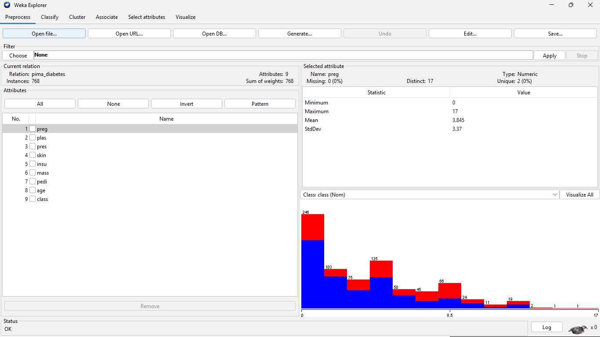

We can see here that the dataset contains 768 entries, with 9 columns (preg, plas, pres, skin, insu, mass, pedi, age, class).

---

Now, we'll check for duplicate rows, remove missing values by column, and check for any zero rows in all the columns, since zero values for glucose, blood pressure, skin thickness, insulin, BMI, diabetes pedigree function, and age can't medically be zero. 

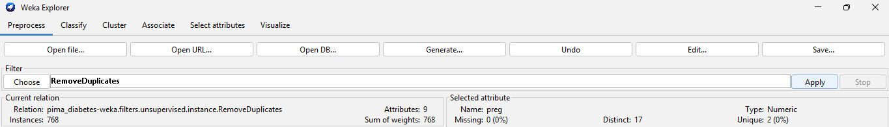

This dataset does not contain any duplicate records. 

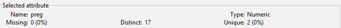
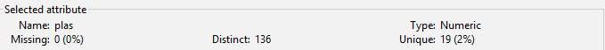
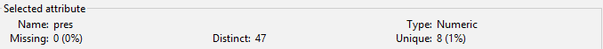
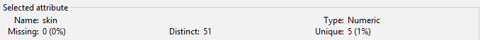
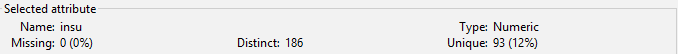
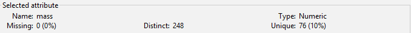
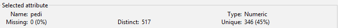
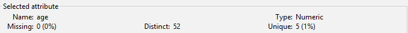
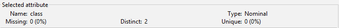

Zero rows in each column:

1. Glucose (plas): 5
2. Blood Pressure (pres): 35
3. Skin Thickness (skin): 227
4. Insulin (insu): 374
5. BMI (mass): 11

---

Checking for outliers:
We can simply achieve this by going into filters -> unsupervised -> attribute -> InterquartileRange, set the extremeValuesFactor to 3.0, and the outlier factor to 1.5.

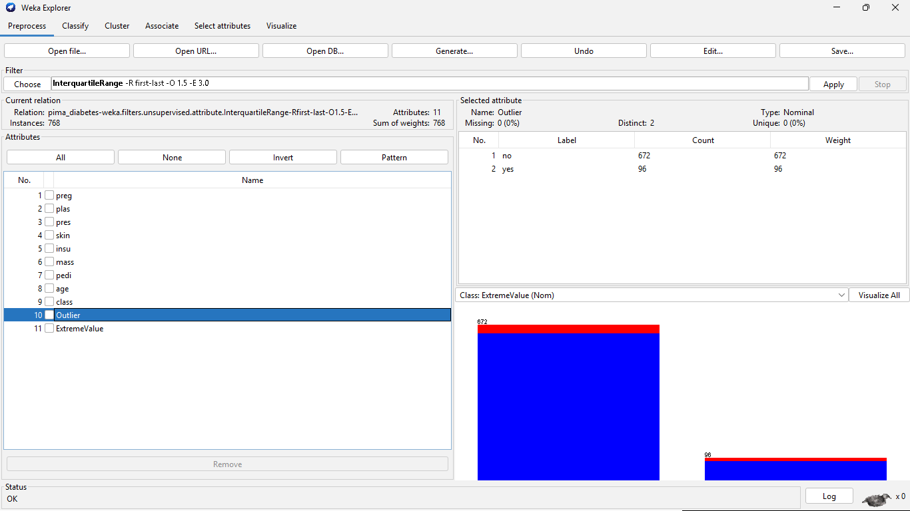

As you can see in the image in the "yes" values, there are 96 outliers. Outliers are values that differ significantly from other observations. 

---

# Cleaning Pipeline

First, we'll replace all the medically impossible values (like zeros in glucose, blood pressure, etc.) with NaN values. 

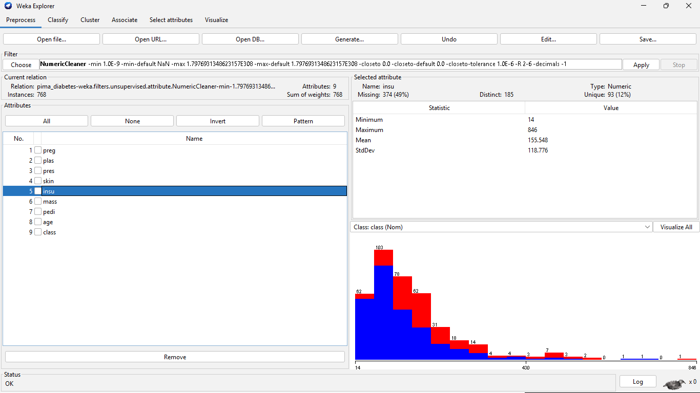

---

We'll now replace the missing (NaN) values with means. To do this, go to filters -> unsupervised -> attribute -> ReplaceMissingValues. This will automatically put mean values inside those rows. 

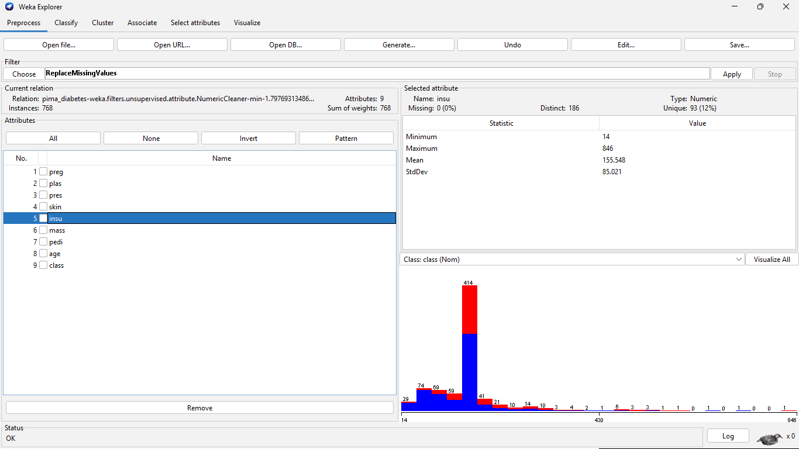

As you can see, the missing values are now gone, and it shows "0" in the "missing" field.

---

# Creating the Model

We will now create a model using this dataset. I'll be using Logistic Regression for this, as Logistic regression is widely used to create predictive models for binary outcomes like "diabetic" vs. "healthy" because it is a highly efficient, interpretable, and effective machine learning classification algorithm. It is frequently favored in clinical analysis and medical research because it can produce a probability of disease occurrence (0 to 1) rather than just a simple binary label.

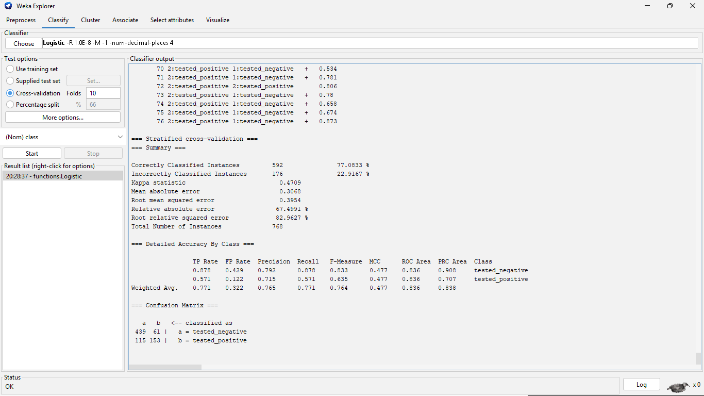

As you can see, the accuracy of the model is 77.0833%. 

---

# Testing the Model

We'll create a new `.csv` file with the input values. I'll create 10 dummy patients, which we'll test the model on. 

```
preg,plas,pres,skin,insu,mass,pedi,age,class
2,130,70,30,120,28.5,0.400,35,?
0,95,65,20,85,22.1,0.250,22,?
8,180,90,45,300,38.5,1.200,55,?
4,115,72,28,150,29.0,0.500,30,?
10,125,80,32,180,31.2,0.600,42,?
1,165,75,18,110,24.5,0.800,28,?
3,105,85,40,210,42.0,0.300,38,?
5,140,78,25,130,27.8,0.450,65,?
0,110,60,35,450,33.0,0.900,21,?
2,120,70,22,95,26.5,1.800,29,?
```

We'll now test out our model. 

On the Classify tab, look at the Test options box. Select the Supplied test set radio button. Click the Set... button right next to it. Click Open file... and select your new_patient.csv file. Click Close. Ensure your Output Predictions are still turned on (More options... -> Output predictions -> PlainText). Now, go back down to your Result list in the bottom left. Right-click your functions.Logistic model again and select Re-evaluate model on current test set.

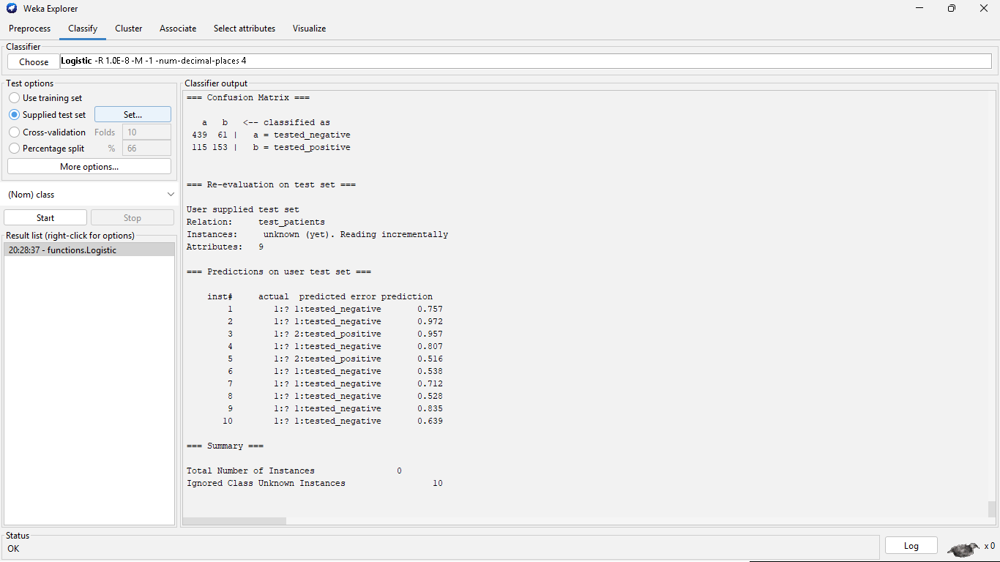

As you can see from the below results:

```
=== Predictions on user test set ===

    inst#     actual  predicted error prediction
        1        1:? 1:tested_negative       0.757  
        2        1:? 1:tested_negative       0.972 
        3        1:? 2:tested_positive       0.957 
        4        1:? 1:tested_negative       0.807 
        5        1:? 2:tested_positive       0.516 
        6        1:? 1:tested_negative       0.538 
        7        1:? 1:tested_negative       0.712 
        8        1:? 1:tested_negative       0.528 
        9        1:? 1:tested_negative       0.835 
       10        1:? 1:tested_negative       0.639 
```

actual 1:? — This proves WEKA recognized this was an unknown patient.
predicted 1:0 — This is your state (0 is your index for tested_negative / Healthy, tested_positive / Diabetic).
prediction 0.830 - This is the confidence level, can be converted into percentage, but the closer the value to 1, the higher the confidence level. 

You can see on patient 2, it gave us the highest level of confidence (97.2%) tested negative (healthy). On patients 3 and 5, it gave us a confidence level of 95.7% and 51.6% respectively, with tested positive (diabetic).

This concludes our mini project for Diabetes Prediction System using the WEKA Tool.

---